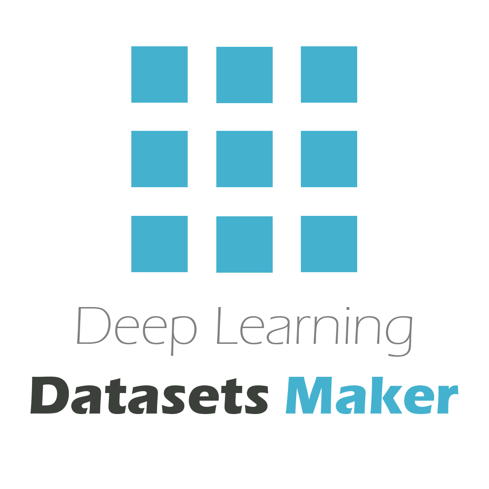

<div align="center">
  <article style="display: flex; flex-direction: column; align-items: center; justify-content: center;">
      <p align="center"></p>
      <h1 style="width: 100%; text-align: center;">Deep Learning Dataset Maker</h1>
      <p align="center">We ❤️ Open Source</p>
  </article>
</div>

[](https://www.python.org/downloads/release/python-380/) [](https://www.qgis.org/) [](https://github.com/psf/black)  

## Deep Learning Datasets Maker is a QGIS plugin to make datasets creation easier for raster and vector data.
Run [QGIS Desktop App (3.18)](https://qgis.org/en/site/) vi BinderHub! Click the button below to launch a server:

[](https://mybinder.org/v2/gh/Youssef-Harby/jupyter-qgis/qgis?urlpath=desktop)


<p align="center">
  
  
  
</p>

## How to use

1. Download and install [QGIS](https://www.qgis.org/en/site/) and clone the repo :
``` git
git clone git@github.com:deepbands/deep-learning-datasets-maker.git
```
2. Install requirements :
   - Enter the folder and install dependent libraries using OSGeo4W shell (Open As Administrator) :
   ``` shell
   cd deep-learning-datasets-maker
   pip install -r requirements.txt
   ```
   - Or open OSGeo4W shell as administrator and enter :
    ``` shell
    pip install Cython scikit-image Pillow pycocotools --user
    ```

3. Copy folder named deep-learning-datasets-maker in QGIS configuration folder and choose the plugin from plugin manager in QGIS (If not appeared restart QGIS).
   - You can know this folder from QGIS Setting Menu at the top-left of QGIS UI `Settings > User Profiles > Open Active Profile Folder` .
   - Go to `python/plugins` then paste the deep-learning-datasets-maker folder.
   - Full path should be like : `C:\Users\$USER\AppData\Roaming\QGIS\QGIS3\profiles\default\python\plugins\deep-learning-datasets-maker`.

4. Open QGIS, load your raster and vector data then select the output paths for rasterized, images and labels then click `ok`.

## TODO
**v0.2**
- [ ] Fix: If vector layer saved in memory not in file, `rasterize` can't work.
- [x] Splitting raster data into equal pieces with [GDAL](https://github.com/OSGeo/gdal) , https://gdal.org/.
- [X] Fix: Splitiing Image Size.
- [x] Rasterize shapefile to raster in the same satellite pixel size and projection.
- [x] Convert 24 or 16 bit raster to 8 bit.
- [x] Export as jpg (for raster) and png (for rasterized shapefile) with GDAL.
- [X] Converted semantic segmentation (0 and 1) to instance segmentation for labels (the original label is 0/255) option, and the result is a single-channel image that uses a palette to color. 
- [X] PaddlePaddle Train/Val/Testing list text.
- [X] Use GDAL for instance segmentation instead of openCV.
- [X] Support COCO format.
- [X] Update plugin's UI : 
  - [X] Add new checkbox for other annotations like COCO.

**v0.3**
- [ ] Fix : raster and vector full path on Linux/macOS (Sometimes cannot gdal/ogr.open from the full path because of forward slash ``/path_to_raster`` and backward slash ``\path_to_raster`` )
